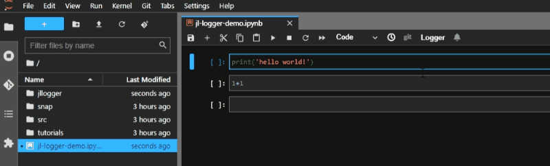
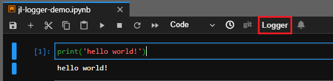
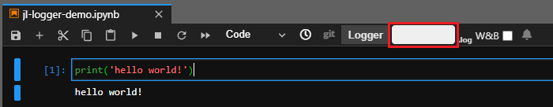
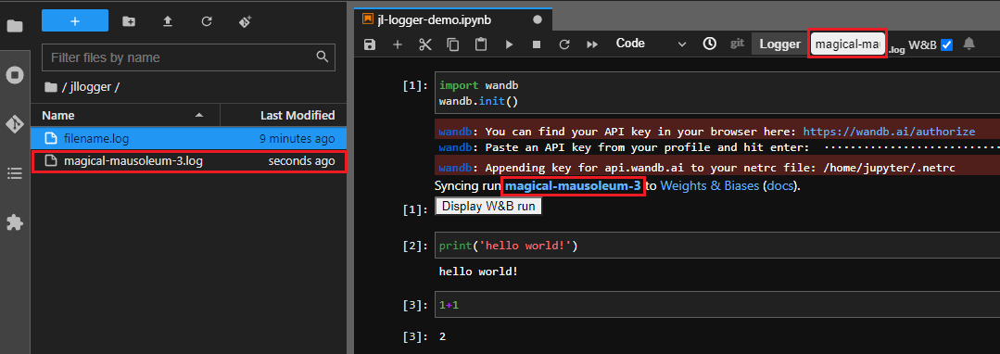

# jl-logger

<div>
    
</div>
A JupyterLab logging extension.


## Requirements

* Node.js
* JupyterLab >= 3.0

## Install

To install the extension, execute:

```bash
pip install jl-logger
```

## Uninstall

To remove the extension, execute:

```bash
pip uninstall jl-logger
```

## Usage

1. Click Logger button in  toolbar.
    <div>
        
    </div>
2. Input log filename.
    <div>
        
    </div>
    Or Check W&B and jl-logger can automatically extract run name and autocomplete filename.
    <div>
        
    </div>
    
    
    <div>
        
    </div>
3. Execution result is logged to specified filename.
    <div>
        
    </div>
    <b>NOTE</b>:
    If you activate jl-logger without specifying filename, execution result is logged to [yyyyMMddHmm].log. 

